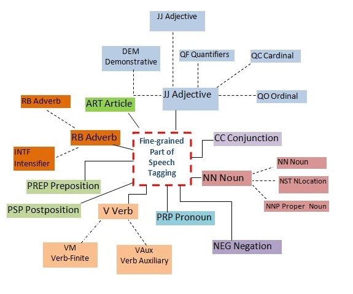

Part-of-speech tagging is the process of assigning a part-of-speech (lexical class marker) to each word in a corpus. In traditional grammars there were generally only a few parts of speech and therefore we need to expand the number of categories. Further distinction within each class helps in incorporating futther knowledge in each tag.
 
 

### Objective

To understand and test the knowledge of more fine-grained part of speech of words as they appear in a sentence.
